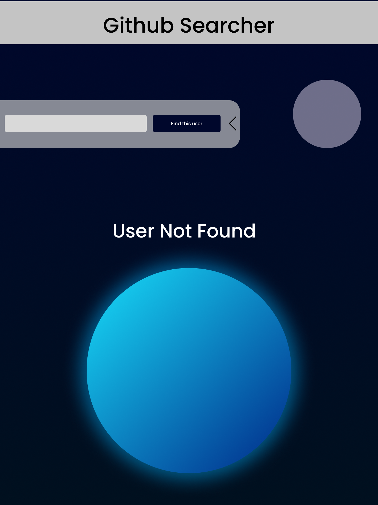

# Github Searcher

## Mockup and Frames - pre develepment

## Ferramentas para construcao do projeto

- Bundler => Vite
- Router => React-router-dom
- Etilizacao => Module.css + postcss
- Requisicoes de api => axios
- script para geracao de files => plop
- Tipificacao estatica => typescript
- Testes Unitarions => vitest + react-testing-library
- Testes E2E => Cypress
- Icons => [unplugin-icons](https://github.com/antfu/unplugin-icons)

---

## Rodar Localmente

> E necessario criar um token
> https://docs.github.com/en/authentication/keeping-your-account-and-data-secure/creating-a-personal-access-token

# Entrega

[ ] O código possui algum controle de dependências?
[ ] O resultado final está completo para ser executado?
[ ] O resultado final atende ao que se propõe fazer?
[ ] O resultado final atende totalmente aos requisitos propostos?
[ ] O resultado final é visualmente elegante?

Boas Práticas

[ ] O código está de acordo com o guia de estilo da linguagem?
[ ] O código está bem estruturado?
[ ] O código está fluente na linguagem?
[ ] O código faz o uso correto de Design Patterns?

Documentação

[ ] O código foi entregue com um arquivo de README claro de como se guiar?
[ ] O código possui comentários pertinentes?
[ ]O código está em algum controle de versão?
[ ] Os commits são pequenos e consistentes?
[ ] As mensagens de commit são claras?

Código Limpo

[ ] opcional O código possibilita expansão para novas funcionalidades?
[ ] O código é Don't Repeat Yourself?
[ ] O código é fácil de compreender?

Controle de Qualidade

[ ] opcional O código possui configuração de lint?

[ ] opcional O código possui testes unitários?

[ ] opcional O código possui testes de integração?
